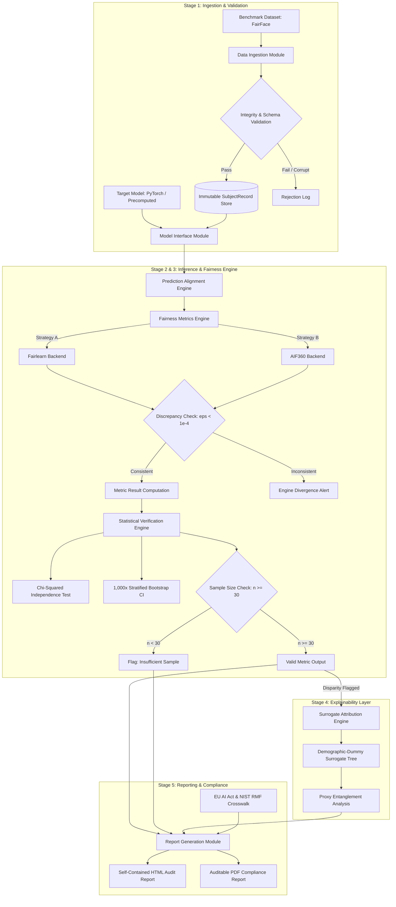

# BiasAperture — Master Proposal Defense Dossier

### Complete Phase 1 Documentation, Specification, Literature Review, Architecture, and Defense Preparation Framework

**Project Title:** _BiasAperture: A Diagnostic and Evaluative Framework for Auditing Demographic Bias in Facial Analysis Systems_  
**Fellowship Program:** Fusemachines AI Fellowship (AIF) 2026  
**Institutional Affiliation:** Department of Electronics and Computer Engineering, Thapathali Campus, Institute of Engineering (IOE), Tribhuvan University  
**Presenters / Authors:** Aaradhya Dev Tamrakar & Tisha Manandhar  
**Supervisor / Mentor:** Shreejan Kisee (Teaching Assistant, Fusemachines AI Fellowship)  
**Track:** Computer Vision / Ethical AI / Trustworthy Machine Learning  
**Date:** September 2026

---

## Document Purpose & Fellowship Rubric Mapping

This master dossier synthesizes **every deliverable, specification, theoretical foundation, engineering architecture, and defense strategy** required up to and through the **Proposal Defense (Phase 1)** of the Fuse AI Fellowship Capstone Project. It directly mirrors the official two-phase evaluation rubric:

```
====================================================================================================
AI FELLOWSHIP CAPSTONE EVALUATION RUBRIC — PHASE 1 MAPPING (30 / 100 MARKS)
====================================================================================================
Sub-Metric                            | Marks | Dossier Section / Deliverables
--------------------------------------|-------|-----------------------------------------------------
1. Problem Statement & Requirements    | 10    | Part 1: PRD, Strict Diagnostic Scope, URD, FRs/NFRs
2. Literature Review & Positioning     | 10    | Part 2: Literature Matrix, Critical Survey, 7-Tool Audit
3. Presentation Clarity & Structure   | 5     | Part 4: 18-Slide Blueprint, Narrative Flow, WBS/Gantt
4. Q&A Handling & Defense Rigour      | 5     | Part 5: Novelty Defense, 32 Hard Questions, Cut-List
--------------------------------------|-------|-----------------------------------------------------
PHASE 1 SUBTOTAL                      | 30    | Target Score: 30 / 30
--------------------------------------|-------|-----------------------------------------------------
Phase 2 Setup: Repo Hygiene & Collab  | (70)  | Part 6: Git Branching, Contracts, PR Workflow Setup
====================================================================================================
```

---

# Table of Contents

- [BiasAperture — Master Proposal Defense Dossier](#biasaperture--master-proposal-defense-dossier)
  - [Document Purpose \& Fellowship Rubric Mapping](#document-purpose--fellowship-rubric-mapping)
- [Table of Contents](#table-of-contents)
- [Executive Overview \& Defense Identity](#executive-overview--defense-identity)
- [Part 1: Product Requirements Document (PRD) \& Problem Statement \[10 Marks\]](#part-1-product-requirements-document-prd--problem-statement-10-marks)
  - [1.1 Problem Statement \& The Operational Gap](#11-problem-statement--the-operational-gap)
  - [1.2 Project Context, Justification \& Application Domains](#12-project-context-justification--application-domains)
  - [1.3 Strict Diagnostic Scope: Non-Negotiable Boundaries](#13-strict-diagnostic-scope-non-negotiable-boundaries)
  - [1.4 Project Goals \& Specific Objectives](#14-project-goals--specific-objectives)
  - [1.5 System Constraints, Assumptions \& Design Guarantees](#15-system-constraints-assumptions--design-guarantees)
  - [1.6 User Personas \& Stakeholder Requirements](#16-user-personas--stakeholder-requirements)
  - [1.7 Functional Requirements (FR-001 to FR-009)](#17-functional-requirements-fr-001-to-fr-009)
  - [1.8 Non-Functional Requirements (NFR-001 to NFR-008)](#18-non-functional-requirements-nfr-001-to-nfr-008)
  - [1.9 Benchmark Dataset Specification \& Data Governance](#19-benchmark-dataset-specification--data-governance)
  - [1.10 Target Models \& Model Interface Architecture](#110-target-models--model-interface-architecture)
  - [1.11 Hardware, Software \& Resource Sizing Specifications](#111-hardware-software--resource-sizing-specifications)
- [Part 2: Literature Review, Theoretical Framework \& Positioning \[10 Marks\]](#part-2-literature-review-theoretical-framework--positioning-10-marks)
  - [2.1 Research Questions \& Analytical Decomposition](#21-research-questions--analytical-decomposition)
  - [2.2 Foundational Conceptual Frameworks](#22-foundational-conceptual-frameworks)
  - [2.3 Critical Analysis of the Literature (The 14 Pillars)](#23-critical-analysis-of-the-literature-the-14-pillars)
  - [2.4 Official Literature Review Matrix (Walden / AIF Standard)](#24-official-literature-review-matrix-walden--aif-standard)
  - [2.5 Comparative Landscape Analysis: 7-Tool Audit Matrix](#25-comparative-landscape-analysis-7-tool-audit-matrix)
  - [2.6 Academic \& Engineering Positioning: The Novelty Defense](#26-academic--engineering-positioning-the-novelty-defense)
- [Part 3: System Architecture, Methodology \& Mathematical Formulation](#part-3-system-architecture-methodology--mathematical-formulation)
  - [3.1 End-to-End System Architecture](#31-end-to-end-system-architecture)
  - [3.2 Object-Oriented Software Design \& SOLID Principles](#32-object-oriented-software-design--solid-principles)
  - [3.3 The Core Four Disparity Metrics (Formulation \& Harmonization)](#33-the-core-four-disparity-metrics-formulation--harmonization)
  - [3.4 Statistical Rigour Protocol \& Safeguard Guardrails](#34-statistical-rigour-protocol--safeguard-guardrails)
  - [3.5 Explainability Protocol \& Surrogate Feature Attribution](#35-explainability-protocol--surrogate-feature-attribution)
  - [3.6 Statutory Regulatory Traceability Crosswalk](#36-statutory-regulatory-traceability-crosswalk)
- [Part 4: Presentation \& Defense Strategy \[5 Marks Clarity \& Structure\]](#part-4-presentation--defense-strategy-5-marks-clarity--structure)
  - [4.1 Defense Format, Time Budget \& Pacing Plan](#41-defense-format-time-budget--pacing-plan)
  - [4.2 Complete 18-Slide Presentation Blueprint \& Talking Points](#42-complete-18-slide-presentation-blueprint--talking-points)
  - [4.3 Work Breakdown Structure (WBS) \& Sprints (M1 to M5)](#43-work-breakdown-structure-wbs--sprints-m1-to-m5)
  - [4.4 Project Timeline \& Milestone Schedule](#44-project-timeline--milestone-schedule)
  - [4.5 Team Workload Distribution \& Ownership Matrix](#45-team-workload-distribution--ownership-matrix)
- [Part 5: Q\&A Grilling Defense, Hard Questions \& Traps \[5 Marks Q\&A Handling\]](#part-5-qa-grilling-defense-hard-questions--traps-5-marks-qa-handling)
  - [5.1 Defense Philosophy \& Panel Psychology](#51-defense-philosophy--panel-psychology)
  - [5.2 The Core Novelty Defense Script](#52-the-core-novelty-defense-script)
  - [5.3 Scripted Answers to 32 Anticipated Defense Questions](#53-scripted-answers-to-32-anticipated-defense-questions)
  - [5.4 "Numbers You Must Know Cold" Reference Card](#54-numbers-you-must-know-cold-reference-card)
  - [5.5 Critical Traps to Avoid During Defense](#55-critical-traps-to-avoid-during-defense)
  - [5.6 5-Tier Descoping Cut-List (Contingency Architecture)](#56-5-tier-descoping-cut-list-contingency-architecture)
- [Part 6: Proposal Defense Readiness \& Deliverables Checklist](#part-6-proposal-defense-readiness--deliverables-checklist)
  - [6.1 Phase 1 Submission Checklist](#61-phase-1-submission-checklist)
  - [6.2 Repository Hygiene \& Phase 2 Alignment Verification](#62-repository-hygiene--phase-2-alignment-verification)

---

# Executive Overview & Defense Identity

BiasAperture is a modular, diagnostic and evaluative software platform designed to audit computer vision models (specifically facial analysis systems) for demographic and intersectional accuracy disparities. Rather than acting as another machine learning model or mitigation algorithm, BiasAperture operates as **metrology infrastructure**: an independent, reproducible auditing platform that accepts a target model (via in-process Python execution or precomputed predictions file) and a demographically annotated benchmark dataset (FairFace), computes four standardized fairness disparity metrics, validates each metric with chi-squared significance tests and 95% bootstrap confidence intervals, isolates potential demographic proxy entanglements through surrogate explainability, and outputs an offline, self-contained HTML/PDF compliance report mapped directly to the **EU AI Act (Regulation EU 2024/1689)** and **NIST AI Risk Management Framework (AI RMF 1.0)**.

---

# Part 1: Product Requirements Document (PRD) & Problem Statement [10 Marks]

## 1.1 Problem Statement & The Operational Gap

Automated facial analysis models—performing tasks such as perceived gender classification, age estimation, and facial attribute detection—are increasingly deployed across critical civic and commercial domains, including automated video surveillance, biometric building access control, fintech e-KYC onboarding, and video-based recruitment screening.

Despite their ubiquity, these models suffer from well-documented, statistically significant accuracy disparities across demographic groups. The seminal _Gender Shades_ study (Buolamwini & Gebru, 2018) revealed that commercial facial analysis APIs produced error rates up to **34.7% for darker-skinned female subjects**, compared to just **0.8% for lighter-skinned male subjects**. Subsequent computer vision surveys (Dehdashtian et al., 2024) confirm that while theoretical fairness metrics and training-time de-biasing algorithms have proliferated, **the operational auditing workflow remains fragmented, ad hoc, and unstandardized**.

Currently, practitioners and auditors face a critical engineering gap:

1. **Ad Hoc, Non-Reproducible Scripts:** Most evaluations are manual, single-point-in-time assessments written in disorganized Jupyter notebooks that lack standardized data pipelines.
2. **Library Incompatibility & Mathematical Divergence:** Existing fairness libraries (e.g., Fairlearn, AIF360) use conflicting mathematical definitions, incompatible input formats (tabular dataframes vs. multi-label tensors), and divergent metric naming conventions.
3. **Absence of Statistical Safeguards:** Common tools report bare point estimates or ratios (such as the 80% Disparate Impact Rule) without significance testing, confidence intervals, or sample size checks, violating fundamental statistical standards (Watkins et al., 2022).
4. **Disconnection from Emerging Regulations:** With binding obligations taking effect under the **EU AI Act (Article 10)** and **NIST AI RMF 1.0 (Measure 2.11)**, organizations lack technical infrastructure to generate auditable, regulator-legible compliance artifacts.

> **Formal Problem Statement:**  
> _"There is a critical engineering gap between a mature body of algorithmic fairness research and the availability of an accessible, reusable, standards-aligned software platform that operationalizes this research into a repeatable auditing workflow for facial analysis systems."_

---

## 1.2 Project Context, Justification & Application Domains

### Application Domains

- **High-Stakes Biometric Authentication:** Ensuring e-KYC and border clearance systems do not disproportionately reject or misclassify underrepresented demographic groups.
- **Human Resources & Automated Video Interviewing:** Evaluating commercial video screening algorithms for Title VII / Disparate Impact compliance.
- **Independent Third-Party AI Auditing:** Equipping external auditors, regulatory agencies, and research labs with black-box evaluation tools that do not require internal model weights.

### Project Justifications

- **Regulatory Deadline:** The EU AI Act (Regulation 2024/1689) establishes mandatory data governance, representativeness, and bias auditing requirements for high-risk AI systems (Annex III), making automated audit infrastructure an urgent statutory need.
- **Economic & Reputational De-Risking:** Pre-deployment auditing prevents the catastrophic reputational and legal fallout of deploying discriminatory biometric systems.
- **Metrological Separation of Concerns:** Decoupling the _auditing platform_ from _model training_ guarantees an objective, uncompromised evaluation.

---

## 1.3 Strict Diagnostic Scope: Non-Negotiable Boundaries

To maintain engineering focus, scientific validity, and statistical integrity, BiasAperture enforces a **strict diagnostic scope**.

```
+-------------------------------------------------------------------------------+
|                        BIASAPERTURE SYSTEM BOUNDARY                           |
|                                                                               |
|   IN SCOPE (Diagnostic & Evaluative Platform)                                 |
|   [x] Ingest benchmark datasets (FairFace 97,698 images)                      |
|   [x] Standardize schema (Race, Gender, Age) into immutable SubjectRecord     |
|   [x] Obtain predictions (In-Process PyTorch or CSV/JSON Prediction Files)    |
|   [x] Compute Core Four Fairness Metrics (DIR, EOD, EOP, DPD)                 |
|   [x] Dual-backend cross-checking (Fairlearn vs AIF360 harmonization)         |
|   [x] Calculate Chi-Squared Significance Tests (p < 0.05) & 95% Bootstrap CI   |
|   [x] Suppress unsafe subgroups (n < 30 sample size guard)                    |
|   [x] Demographic-dummy surrogate feature attribution for flagged disparities |
|   [x] Generate self-contained, offline HTML/PDF compliance reports             |
|   [x] Trace metrics directly to EU AI Act Art. 10 & NIST AI RMF 1.0           |
+-------------------------------------------------------------------------------+
|   STRICTLY OUT OF SCOPE (Prohibited by Architecture & AGENTS.md Rule 1)       |
|   [!] NO model retraining or weight fine-tuning                               |
|   [!] NO in-processing adversarial debiasing or loss modification             |
|   [!] NO post-processing prediction threshold alteration or calibration       |
|   [!] NO synthetic facial image generation (e.g., GANs, Diffusion models)     |
|   [!] NO legal certification or statutory compliance guarantees               |
+-------------------------------------------------------------------------------+
```

**Justification for Scope Separation:** An auditor cannot be both the judge and the defendant. Attempting to debias or alter a model inside the evaluation engine invalidates the independence of the audit and introduces unverified distribution shifts.

---

## 1.4 Project Goals & Specific Objectives

### General Objective

To design, implement, and validate an end-to-end diagnostic and evaluative software platform, **BiasAperture**, that systematically identifies demographic and intersectional accuracy disparities in facial analysis models and exports them in a standardized, regulator-legible format.

### Specific Objectives

1. **Modular Ingestion Engine:** Build an ingestion architecture that loads, validates, and aligns benchmark datasets (FairFace) and ingests model inferences via dual modalities (in-process PyTorch model object or precomputed CSV/JSON prediction records).
2. **Harmonized Fairness & Statistical Engine:** Integrate and cross-validate AIF360 and Fairlearn backends to compute the Core Four disparity metrics, backed by chi-squared significance tests ($p < 0.05$) and 95% bootstrap confidence intervals ($B \ge 1,000$).
3. **Automated Compliance Reporting:** Develop a Jinja2-powered reporting engine that synthesizes findings into an offline, exportable HTML/PDF document adhering to Model Cards and Datasheets for Datasets conventions.
4. **Empirical Benchmark Validation:** Validate the framework against FairFace’s 97,698 images using a trained ResNet-34 baseline classifier to profile real-world demographic disparities.
5. **Statutory Regulatory Mapping:** Formally map every computed metric and test to specific clauses of the EU AI Act (Article 10, Annex III/IV) and NIST AI RMF 1.0 (Measure 2.11).

---

## 1.5 System Constraints, Assumptions & Design Guarantees

### Constraints

- **C-1: Pure Diagnostic Role:** System performs evaluation only; no weight modification or debiasing.
- **C-2: Local & Offline Execution:** Must run completely locally without sending facial images or prediction data to external cloud APIs, ensuring strict compliance with GDPR/data privacy laws.
- **C-3: Pure Python 3.10+ Stack:** Cross-platform portability across Linux, macOS, and Windows.
- **C-4: Schema Lock Invariance (M1):** The data contracts (`SubjectRecord`, `MetricResult`, demographic taxonomies) defined in `src/bias_aperture/schema.py` are strictly locked; changes constitute breaking changes.

### Assumptions

- **A-1: Ground Truth Label Integrity:** Audit validity relies on the benchmark annotations. FairFace’s balanced annotations serve as the established research baseline.
- **A-2: Binary / Multi-Class Task Formulations:** The initial case study focuses on binary classification (e.g., perceived gender classification) across multi-class demographic strata (7 races, 2 genders, 9 age groups).
- **A-3: Bounded Compute Availability:** The system must run on consumer hardware (minimum 4-core CPU, 8GB RAM; recommended 8GB VRAM GPU).

### Non-Negotiable Design Guarantees

- **The $n < 30$ Sample Guard:** Subgroups with fewer than 30 samples must never display calculated metric values; they must be suppressed with `insufficient_sample=True` and `metric_value=None` (enforced at dataclass instantiation).
- **Dual Verification:** Any numerical discrepancy exceeding $\epsilon = 10^{-4}$ between Fairlearn and AIF360 on identical inputs triggers an automated engine alert.
- **Zero Bare Ratios:** Every metric point estimate must be flanked by an exact $p$-value and a 95% Bootstrap CI $[CI_{lower}, CI_{upper}]$.

---

## 1.6 User Personas & Stakeholder Requirements

| Persona                                             | Role & Objectives                                                                                                                          | Key Platform Requirements                                                                                                                                |
| --------------------------------------------------- | ------------------------------------------------------------------------------------------------------------------------------------------ | -------------------------------------------------------------------------------------------------------------------------------------------------------- |
| **Dr. Elena Vance**<br>_Lead AI Compliance Auditor_ | Performs independent bias audits on facial analysis systems before commercial deployment. Needs auditable evidence for regulatory filings. | • Dual-backend cross-checked metrics<br>• Direct EU AI Act Art. 10 mapping<br>• Standalone, offline HTML report export                                   |
| **Marcus Chen**<br>_Computer Vision Engineer_       | Trains facial recognition and attribute models. Wants to identify which demographic slices fail during validation.                         | • CLI-driven batch evaluation<br>• In-process PyTorch model interface<br>• Fast subset execution ($n=5,000$ in $<30$ min)                                |
| **Sophia Rodriguez**<br>_Enterprise Legal Counsel_  | Assesses organizational risk and algorithmic discrimination liability under civil rights and AI legislation.                               | • Clear, plain-language executive summaries<br>• Explanations of statistical significance (Watkins critique)<br>• Datasheets & Model Cards documentation |

---

## 1.7 Functional Requirements (FR-001 to FR-009)

_Formulated using IEEE 830-style "shall" statements with MoSCoW prioritization._

```
========================================================================================================================
BIASAPERTURE FUNCTIONAL REQUIREMENTS MATRIX
========================================================================================================================
Req ID  | Priority | Requirement Statement & Acceptance Criteria
--------|----------|----------------------------------------------------------------------------------------------------
FR-001  | MUST     | Data Ingestion & Alignment: The system shall load, validate, and standardize FairFace image files
        |          | and CSV annotations, verifying file integrity and mapping demographic labels (race, gender, age)
        |          | into an immutable SubjectRecord schema.
--------|----------|----------------------------------------------------------------------------------------------------
FR-002  | MUST     | Dual-Mode Model Interface: The system shall accept predictions via two interchangeable interfaces:
        |          | (a) InProcessInterface for executing live PyTorch/TensorFlow models, and
        |          | (b) PredictionsFileInterface for batch-ingesting precomputed CSV/JSON prediction records.
--------|----------|----------------------------------------------------------------------------------------------------
FR-003  | MUST     | Core Four Metric Computation: The system shall compute per-subgroup and intersectional disparity
        |          | metrics—DIR, EOD, EOP, and DPD—using Fairlearn and AIF360 as cross-validating backends.
--------|----------|----------------------------------------------------------------------------------------------------
FR-004  | MUST     | Statistical Rigour: The system shall calculate a Chi-Squared test of independence (reporting exact
        |          | p-value) and a 95% Bootstrap Confidence Interval (B >= 1,000 resamples) for every disparity metric.
--------|----------|----------------------------------------------------------------------------------------------------
FR-005  | SHOULD   | Surrogate Explainability: The system shall compute demographic-dummy surrogate feature attribution
        |          | on flagged disparity cohorts to isolate potential proxy-variable entanglements (SHAP deferred).
--------|----------|----------------------------------------------------------------------------------------------------
FR-006  | MUST     | Standardized Reporting: The system shall generate an exportable, self-contained HTML/PDF compliance
        |          | report structured after Model Cards and Datasheets for Datasets conventions.
--------|----------|----------------------------------------------------------------------------------------------------
FR-007  | MUST     | Statutory Regulatory Crosswalk: The system shall map every metric and statistical check directly
        |          | to corresponding clauses of the EU AI Act (Article 10) and NIST AI RMF 1.0 (Measure 2.11).
--------|----------|----------------------------------------------------------------------------------------------------
FR-008  | SHOULD   | CLI Orchestration: The system shall provide a unified Command Line Interface (CLI) allowing auditors
        |          | to configure data paths, model targets, metrics, bootstrap iterations, and report output paths.
--------|----------|----------------------------------------------------------------------------------------------------
FR-009  | COULD    | Licensing Transparency: The system shall present and require explicit user acknowledgement of
        |          | benchmark dataset licensing terms prior to audit execution.
========================================================================================================================
```

---

## 1.8 Non-Functional Requirements (NFR-001 to NFR-008)

- **NFR-001 (Statistical Significance Cutoff):** All hypothesis tests shall enforce significance level $\alpha = 0.05$. Exact $p$-values must be reported to 4 decimal places (never as a binary pass/fail).
- **NFR-002 (Bootstrap Uncertainty):** Confidence intervals must be computed using $B \ge 1,000$ stratified bootstrap resamples at a 95% confidence level ($2.5^{th}$ and $97.5^{th}$ percentiles).
- **NFR-003 (Sample Size Integrity Guard):** Any demographic subgroup with sample size $n < 30$ shall be automatically marked `insufficient_sample = True` and its metric value suppressed to prevent small-sample noise artifacts.
- **NFR-004 (Audit Execution Performance):** Full evaluation of FairFace (97,698 images) shall complete within 4 hours on a single mid-range GPU (NVIDIA T4 / RTX 3060). A development subset of $n = 5,000$ images shall complete in $<30$ minutes on a 4-core CPU.
- **NFR-005 (Architectural Modularity):** Modules must follow SOLID principles and expose abstract interfaces (`ModelInterface`, `FairnessBackend`). Zero cyclic dependencies allowed.
- **NFR-006 (Reproducibility & Determinism):** Resampling procedures must accept fixed pseudo-random seeds (`random_state=42`). All dependency versions must be pinned in `pyproject.toml`.
- **NFR-007 (Cross-Platform Portability):** The software shall execute identically without modification on Linux (Ubuntu 22.04+), macOS (Sonoma+), and Windows 10/11.
- **NFR-008 (Explainability Overhead Bounding):** Surrogate attribution analysis shall be restricted to cohorts flagged with statistically significant disparities, ensuring attribution computation occupies $<15\%$ of total audit runtime.

---

## 1.9 Benchmark Dataset Specification & Data Governance

### Primary Benchmark: FairFace (Kärkkäinen & Joo, WACV 2021)

- **Scale:** 97,698 released facial images on disk (86,744 training set + 10,954 validation set).
- **Demographic Balance:** Specifically curated to overcome the severe demographic skews of LFW and CelebA.
- **Taxonomy:**
  - **7 Race/Ethnicity Categories:** White, Black, Indian, East Asian, Southeast Asian, Middle Eastern, Latino_Hispanic.
  - **2 Perceived Gender Categories:** Male, Female.
  - **9 Age Brackets:** 0–2, 3–9, 10–19, 20–29, 30–39, 40–49, 50–59, 60–69, 70+.
- **Intersectional Slices:** $7 \times 2 = 14$ primary race-gender intersectional subgroups; $7 \times 2 \times 9 = 126$ full intersectional cohorts.

### Scope Descoping Decision: Profiling, Cut, and Exclusion of UTKFace

During preliminary exploratory data analysis, **UTKFace** was profiled and formally removed from the project scope (Cut-List Tier #2).  
_Rationale:_ UTKFace’s age labels were generated using an unverified automated model rather than human consensus, introducing severe ground-truth label noise that contaminates fairness audits.

### Ethical Data Governance

- **Local Ephemeral Storage:** Facial images are stored locally; no facial data is transmitted across networks.
- **Non-Commercial Research Compliance:** Complies with FairFace’s non-commercial research licensing terms.
- **Privacy by Design:** The system stores only image paths, bounding box coordinates, and categorical predictions—never personal identifying information (PII).

---

## 1.10 Target Models & Model Interface Architecture

BiasAperture evaluates facial analysis models through a clean, decoupled abstraction:

```python
class ModelInterface(ABC):
    @abstractmethod
    def predict(self, images: List[np.ndarray]) -> np.ndarray:
        """Accepts batch of RGB facial crops, returns class predictions."""
        pass

    @abstractmethod
    def predict_proba(self, images: List[np.ndarray]) -> np.ndarray:
        """Returns prediction confidence distribution."""
        pass
```

### Supported Integration Modes

1. **`InProcessInterface`:** Directly instantiates a local PyTorch or TensorFlow model (e.g., FairFace-trained ResNet-34). Batches images into tensors, applies standard transforms ($224 \times 224$ normalization), and collects logits.
2. **`PredictionsFileInterface`:** Ingests a precomputed CSV or JSON file containing `[image_id, predicted_label, confidence_score]`. This supports black-box commercial APIs (AWS Rekognition, Azure Face, Face++) where internal weights or code are inaccessible.

### Validation Target (Baseline Model)

- **Architecture:** ResNet-34 pre-trained on ImageNet and fine-tuned on FairFace for perceived gender classification.
- **Role:** Serves as the primary validation subject to verify that BiasAperture accurately detects known, documented demographic disparities.

---

## 1.11 Hardware, Software & Resource Sizing Specifications

### Hardware Requirements

- **Development Environment (Minimum):**
  - CPU: Quad-core x86-64 (Intel Core i5 / AMD Ryzen 5 or Apple Silicon M1+)
  - RAM: 8 GB DDR4
  - Storage: 10 GB free SSD space
  - Environment: Local execution or Google Colab (CPU runtime)
- **Full Benchmark Audit (Recommended):**
  - CPU: 8 cores
  - RAM: 16 GB DDR4/DDR5
  - GPU: Dedicated NVIDIA GPU with $\ge 8$ GB VRAM (T4, RTX 3060, A10)
  - Storage: 25 GB free NVMe space (to accommodate extracted FairFace tarballs)

### Software Stack

- **Core Runtime:** Python 3.10, 3.11, or 3.12 managed via `uv` package manager.
- **Computer Vision:** OpenCV (`opencv-python-headless`), Pillow (`PIL`).
- **Data Engineering:** NumPy, Pandas, Polars.
- **Fairness Backends:** Fairlearn ($\ge 0.10.0$), AIF360 ($\ge 0.6.1$).
- **Statistical Testing:** SciPy (`scipy.stats.chi2_contingency`), scikit-learn.
- **Reporting Engine:** Jinja2, WeasyPrint / Playwright (PDF export).
- **Code Quality:** Ruff (linting & formatting), Pytest (unit & contract testing).

---

# Part 2: Literature Review, Theoretical Framework & Positioning [10 Marks]

## 2.1 Research Questions & Analytical Decomposition

The overarching research inquiry driving this project is:

> **Primary Research Question:**  
> _"How can facial analysis models be audited for subgroup and intersectional demographic bias in a manner that is reproducible, statistically validated, explainable, and traceably aligned with emerging AI regulations?"_

### Sub-Problem Decomposition

1. **Sub-Problem 1 (Ingestion & Schema Heterogeneity):** How can diverse facial datasets and model outputs be mapped into a unified, type-safe internal schema without losing intersectional granularity?
2. **Sub-Problem 2 (Mathematical Reconciliation):** How can conflicting mathematical definitions and metric implementations between independent fairness libraries (Fairlearn vs. AIF360) be reconciled and verified?
3. **Sub-Problem 3 (Statistical Grounding):** How can auditors avoid "epistemic trespassing" and bare-ratio threshold fallacies when evaluating subgroup disparities on finite samples?
4. **Sub-Problem 4 (Regulatory Metrology):** How can quantitative metric outputs be translated into structured compliance artifacts that directly satisfy statutory mandates under the EU AI Act and NIST AI RMF?

---

## 2.2 Foundational Conceptual Frameworks

### 1. Intersectional Auditing Framework (Crenshaw, 1989; Buolamwini & Gebru, 2018)

Bias cannot be evaluated along single demographic axes in isolation. Evaluating gender parity while aggregating across races masks severe compound disparities. An intersectional framework evaluates overlapping demographic strata ($Race \times Gender \times Age$).

### 2. Group Fairness Parity Criteria (Hardt et al., 2016; Barocas et al., 2019)

Group fairness formalizes independence, separation, and sufficiency criteria:

- **Independence:** Prediction $\hat{Y}$ is statistically independent of sensitive attribute $A$ ($P(\hat{Y}=1 | A=a) = P(\hat{Y}=1 | A=b)$). Measured via Demographic Parity and Disparate Impact Ratio.
- **Separation:** Prediction $\hat{Y}$ is conditionally independent of $A$ given ground truth $Y$ ($P(\hat{Y}=1 | Y=y, A=a) = P(\hat{Y}=1 | Y=y, A=b)$). Measured via Equalized Odds and Equal Opportunity.

### 3. Epistemic Trespassing & The Fallacy of Bare Thresholds (Watkins et al., 2022)

Importing regulatory thresholds from disparate impact case law (e.g., the U.S. EEOC 4/5ths Rule: $DIR < 0.80$) directly into machine learning as a binary pass/fail test constitutes epistemic trespassing. A ratio of 0.79 with $n=10,000$ represents massive systemic discrimination, whereas a ratio of 0.75 with $n=25$ is statistically indistinguishable from random sampling variance. Every metric must be grounded in confidence intervals and hypothesis tests.

### 4. Axiomatic Attribution & Post-Hoc Limitations (Shapley, 1953; Bilodeau et al., 2022; Slack et al., 2020)

Feature attribution allocates predictive credit across inputs. However, impossibility theorems establish that no post-hoc attribution method can prove the absence of proxy discrimination. Therefore, explainability must be framed as _diagnostic triage_ rather than causal proof.

### 5. Regulatory Verification Engineering (Buscemi et al., 2025)

Decomposing complex statutory directives (e.g., EU AI Act Article 10) into concrete, testable software assertions.

---

## 2.3 Critical Analysis of the Literature (The 14 Pillars)

```
========================================================================================================================
THE 14 FOUNDATIONAL LITERATURE PILLARS SUPPORTING BIASAPERTURE
========================================================================================================================
Ref # | Citation                          | Core Finding / Contribution                 | Adoption in BiasAperture
------|-----------------------------------|---------------------------------------------|---------------------------------
1     | Buolamwini & Gebru (2018)         | Intersectional error disparities in CV      | Core motivation; intersectional
      | "Gender Shades"                   | (34.7% error on dark females vs 0.8% males) | stratification methodology
------|-----------------------------------|---------------------------------------------|---------------------------------
2     | Dehdashtian et al. (2024)         | Survey of CV bias & mitigation; identifies   | Defines gap: mature metrics vs
      | "Fairness in Computer Vision"     | lack of standardized audit workflows        | missing diagnostic pipelines
------|-----------------------------------|---------------------------------------------|---------------------------------
3     | Hardt, Price & Srebro (2016)      | Formulates Equalized Odds (EOD) and         | Adopted as core separation
      | "Equality of Opportunity"         | Equal Opportunity (EOP) mathematically      | fairness metrics
------|-----------------------------------|---------------------------------------------|---------------------------------
4     | Watkins et al. (2022)             | Critiques 4/5ths rule & bare thresholding   | Mandates pairing DIR with
      | "Four-Fifths Rule Epistemic..."   | as statistically ungrounded                 | Chi-squared tests & Bootstrap CI
------|-----------------------------------|---------------------------------------------|---------------------------------
5     | Kärkkäinen & Joo (2021)           | FairFace dataset: balanced race, gender,     | Primary benchmark dataset;
      | "FairFace: Balanced Face..."      | age representation (97k images, 7 races)    | 7-race classification baseline
------|-----------------------------------|---------------------------------------------|---------------------------------
6     | Stanley et al. (2025)             | Medical imaging CNNs learn proxy variables  | Motivated surrogate attribution
      | "Where, Why, and How Is Bias..."  | (texture, lighting) as demographic proxies  | to detect proxy entanglement
------|-----------------------------------|---------------------------------------------|---------------------------------
7     | Mitchell et al. (2019)            | Model Cards: structured standardized        | Governs the model evaluation
      | "Model Cards for Model Reporting" | reporting for AI models                     | section of the generated report
------|-----------------------------------|---------------------------------------------|---------------------------------
8     | Gebru et al. (2018/2021)          | Datasheets for Datasets: documenting        | Governs the dataset provenance
      | "Datasheets for Datasets"         | composition, collection, and limitations    | section of the generated report
------|-----------------------------------|---------------------------------------------|---------------------------------
9     | Buscemi et al. (2025)             | Decomposing EU AI Act obligations into      | Direct template for Article 10
      | "Assessing High-Risk AI..."       | concrete technical verification activities  | technical compliance crosswalk
------|-----------------------------------|---------------------------------------------|---------------------------------
10    | Shapley (1953)                    | Axiomatic division of payoff in n-person    | Theoretical foundation of
      | "A Value for n-Person Games"      | cooperative games (efficiency, symmetry)    | feature credit allocation
------|-----------------------------------|---------------------------------------------|---------------------------------
11    | Lundberg & Lee (2017)             | Unified additive feature attribution        | Basis of surrogate & deferred
      | "KernelSHAP: A Unified Approach"  | (KernelSHAP weighted regression)            | spatial explainability
------|-----------------------------------|---------------------------------------------|---------------------------------
12    | Bilodeau et al. (2022)            | Impossibility theorems: attribution cannot  | Reporting rule: attributions are
      | "Impossibility Theorems..."       | reliably establish causal drivers           | associative, never causal proof
------|-----------------------------------|---------------------------------------------|---------------------------------
13    | Slack et al. (2020)               | Adversarial models can fool post-hoc        | Justifies dual-mode interface
      | "Fooling LIME and SHAP"           | surrogate/deferred explainers via           | and bounded surrogate trust
      | [surrogate attribution]           | perturbation detection                      |
------|-----------------------------------|---------------------------------------------|---------------------------------
14    | NIST AI RMF 1.0 (2023)            | AI Risk Management Framework: Govern,       | Second regulatory compliance
      | "NIST AI 100-1"                   | Map, Measure (2.11), Manage functions       | spine alongside EU AI Act
========================================================================================================================
```

---

## 2.4 Official Literature Review Matrix (Walden / AIF Standard)

_The complete 8-column Literature Review Matrix complying with Fuse AI Fellowship requirements:_

| Title / Author / Date                                                        | Conceptual Framework                                             | Research Question(s) / Hypotheses                                                                       | Datasets                                                                    | Methodology                                                                                                                  | Analysis & Results                                                                                                                | Conclusions                                                                                             | Implications for Future Research / Project Adoption                                                              |
| ---------------------------------------------------------------------------- | ---------------------------------------------------------------- | ------------------------------------------------------------------------------------------------------- | --------------------------------------------------------------------------- | ---------------------------------------------------------------------------------------------------------------------------- | --------------------------------------------------------------------------------------------------------------------------------- | ------------------------------------------------------------------------------------------------------- | ---------------------------------------------------------------------------------------------------------------- |
| **Gender Shades**<br>Buolamwini & Gebru (2018)                               | Intersectional demographic auditing of commercial vision systems | Do commercial gender classification APIs exhibit accuracy disparities across skin-type $\times$ gender? | Pilot Parliaments Benchmark (PPB: 1,270 subjects, Fitzpatrick 1–6)          | Intersectional error rate evaluation across commercial APIs (IBM, Microsoft, Face++)                                         | Error rates up to 34.7% for darker females; 0.8% for lighter males. Large, statistically significant gaps.                        | Commercial facial analysis contains severe intersectional demographic bias.                             | Catalyzed CV fairness auditing. Direct foundation for BiasAperture’s problem framing and intersectional slicing. |
| **Fairness & Bias Mitigation in CV: A Survey**<br>Dehdashtian et al. (2024)  | Taxonomic survey of bias sources across the full CV lifecycle    | Where does bias enter the CV pipeline, and how do existing tools evaluate/mitigate it?                  | N/A (Comprehensive survey of $>150$ papers)                                 | Systematic literature taxonomy across data, models, metrics, and mitigations                                                 | Abundant research on mitigation algorithms; severe deficit in standardized, reusable auditing workflows.                          | Field lacks unified diagnostic pipelines for repeatable auditing.                                       | Explicitly identifies the engineering gap BiasAperture closes: building reusable diagnostic metrology.           |
| **Equality of Opportunity in Supervised Learning**<br>Hardt et al. (2016)    | Mathematical group fairness via error-rate parity                | Can fairness be formalized through error rates without sacrificing optimal classification?              | FICO credit scoring simulation                                              | Formal mathematical derivation of Equalized Odds and Equal Opportunity criteria                                              | Equalized Odds requires $TPR$ and $FPR$ equality; Equal Opportunity requires $TPR$ parity only. Distinct concepts.                | Fairness requires explicit conditioning on ground truth labels.                                         | Adopted directly as two of BiasAperture’s Core Four metrics ($EOD$ and $EOP$).                                   |
| **The Four-Fifths Rule is Not Disparate Impact**<br>Watkins et al. (2022)    | Critique of legal threshold transfer ("Epistemic Trespassing")   | Is applying the 80% EEOC employment threshold to algorithms scientifically and statistically sound?     | Employment and algorithmic decision benchmarks                              | Legal doctrinal analysis combined with statistical sampling simulations                                                      | Bare 80% ratio test ignores sample size $n$, yielding false confidence on small samples and missing severe bias on large samples. | Arbitrary ratio thresholds without confidence intervals are unscientific.                               | Directly justifies FR-004: BiasAperture mandates Chi-Squared testing and Bootstrap CI for all ratios.            |
| **FairFace: Balanced Attribute Dataset**<br>Kärkkäinen & Joo (2021)          | Balanced benchmark dataset design for bias evaluation            | Can balanced demographic sampling across race, gender, and age reduce classification bias?              | FairFace (97,698 images; 7 race groups, balanced age/gender)                | Dataset curation, Amazon Mechanical Turk consensus annotation, ResNet baseline evaluation                                    | Models trained on FairFace exhibit significantly lower cross-group performance variance than on CelebA.                           | Balanced representation in benchmarks is essential for valid fairness evaluation.                       | Primary validation dataset for BiasAperture (FR-001); provides the 7-race demographic taxonomy.                  |
| **Where, Why, and How Is Bias Learned...**<br>Stanley et al. (2025)          | Proxy-variable feature entanglement in deep vision networks      | Can deep CNNs encode sensitive demographic attributes from neutral visual features?                     | Controlled synthetic and medical imaging datasets                           | Feature isolation, synthetic variation, and CNN representation probing                                                       | CNNs readily learn demographic proxies from background texture and illumination, even without demographic labels.                 | Disparities are often driven by confounding proxy features rather than the intended subject attributes. | Directly motivates FR-005: BiasAperture implements surrogate explainability to detect proxy entanglement.        |
| **Model Cards for Model Reporting**<br>Mitchell et al. (2019)                | Transparent, standardized documentation convention               | How should model capabilities, limitations, and subgroup evaluations be communicated?                   | Facial analysis and toxicity classification case studies                    | Multi-stakeholder reporting template development and evaluation                                                              | Standardized reporting structures dramatically improve stakeholder comprehension of model risks.                                  | Model performance must be reported across disaggregated demographic slices.                             | Structurally governs the model evaluation sections of BiasAperture’s HTML/PDF reports (FR-006).                  |
| **Datasheets for Datasets**<br>Gebru et al. (2018/2021)                      | Dataset documentation and provenance standardization             | How should dataset curation, composition, and collection limitations be disclosed?                      | Multiple machine learning benchmarks                                        | Design of standardized questionnaire covering motivation, composition, collection, and ethics                                | Structured documentation prevents misuse and clarifies domain limitations for downstream users.                                   | Dataset limitations must be transparently documented alongside models.                                  | Structurally governs the dataset provenance section of BiasAperture’s report (FR-006).                           |
| **Assessing High-Risk AI Systems...**<br>Buscemi et al. (2025)               | Regulatory-to-technical requirement decomposition                | How can legal obligations of the EU AI Act be decomposed into verifiable technical activities?          | EU AI Act regulatory text (Regulation 2024/1689)                            | Formal engineering taxonomy mapping legal articles $\rightarrow$ sub-requirements $\rightarrow$ software verification checks | High-risk AI requirements can be systematically operationalized into automated software checks.                                   | Technical compliance requires concrete verification artifacts, not abstract policies.                   | Methodological blueprint for BiasAperture’s statutory mapping to Article 10 and Annex IV (FR-007).               |
| **A Value for n-Person Games**<br>Shapley (1953)                             | Axiomatic cooperative game theory                                | What unique credit allocation across players satisfies efficiency, symmetry, dummy, and additivity?     | N/A (Axiomatic mathematical derivation)                                     | Mathematical proof over coalition characteristic functions                                                                   | The Shapley value is the mathematically unique allocation satisfying all four fundamental fairness axioms.                        | Fair credit assignment has a unique axiomatic solution in cooperative games.                            | Theoretical bedrock for feature attribution in algorithmic auditing (FR-005).                                    |
| **A Unified Approach to Interpreting...**<br>Lundberg & Lee (2017)           | Unified post-hoc feature attribution                             | Can LIME, DeepLIFT, and Shapley values be unified into a single consistent framework?                   | Benchmark tabular and image classification models                           | Derivation of KernelSHAP via weighted linear regression with the Shapley kernel                                              | Proves KernelSHAP recovers unique additive explanations satisfying local accuracy, missingness, and consistency.                  | Shapley-based post-hoc explanations provide mathematically consistent additive feature importance.      | Grounding for surrogate attribution engine and deferred spatial SHAP implementation.                             |
| **Impossibility Theorems for Feature Attribution**<br>Bilodeau et al. (2022) | Formal boundaries of explainability methods                      | Can post-hoc attribution methods reliably distinguish true causal drivers from spurious correlations?   | Theoretical proof over classes of linear and additive attribution functions | Mathematical analysis of attribution functions under feature confounding                                                     | No method satisfying completeness and linearity can reliably identify causal mechanisms or rule out proxy use.                    | Feature attributions reveal what a model attended to, not why or whether it is legally causal.          | Enforces strict reporting rule: surrogate findings report associations, never "proof of fairness".               |
| **Fooling LIME and SHAP**<br>Slack et al. (2020)                             | Adversarial vulnerability of post-hoc explainers                 | Can discriminatory models disguise their bias from post-hoc explainability audits?                      | Scaffolding wrapper models evaluated on COMPAS and German Credit            | Designed adversarial models that detect perturbation distributions and alter behavior during audit queries                   | Post-hoc explainers like LIME and KernelSHAP can be completely fooled by adversarial wrapper code.                                | Post-hoc attribution alone cannot guarantee fairness; must be coupled with black-box metric auditing.   | Justifies BiasAperture’s dual interface (predictions-file auditing) and cautious explainability scope.           |
| **NIST AI Risk Management Framework**<br>NIST (2023)                         | Trustworthy AI risk management taxonomy                          | What operational functions structure AI risk management across the system lifecycle?                    | Multi-stakeholder federal consensus documentation                           | Categorization into four core functions: Govern, Map, Measure, and Manage                                                    | Establishing repeatable measurement metrics (Measure 2.11) is essential for mitigating societal harms.                            | AI risk assessment must be continuous, quantitative, documented, and repeatable.                        | Secondary compliance framework for BiasAperture; provides metric taxonomy crosswalk.                             |

---

## 2.5 Comparative Landscape Analysis: 7-Tool Audit Matrix

To establish the precise engineering novelty of BiasAperture, we performed an empirical comparative audit across seven prominent open-source fairness toolkits:

```
========================================================================================================================
FEATURE COMPARISON: BIASAPERTURE VS. EXISTING FAIRNESS TOOLKITS
========================================================================================================================
Capability / Dimension        | Fairlearn | AIF360 | Aequitas | Google WIT | JFAM | FAT Forensics | FairTest | BiasAperture
------------------------------|-----------|--------|----------|------------|------|---------------|----------|-------------
1. Computer Vision Native     | No        | No     | No       | Partial    | Yes  | No            | No       | YES
   (Direct image/crop flow)   | (Tabular) |(Tabular|(Tabular) | (Browser)  | (CV) | (Tabular)     | (Tabular)| (CV-Native)
------------------------------|-----------|--------|----------|------------|------|---------------|----------|-------------
2. Dual-Engine Cross-Checking | No        | No     | No       | No         | No   | No            | No       | YES
   (Fairlearn + AIF360 check) |           |        |          |            |      |               |          | (Automated)
------------------------------|-----------|--------|----------|------------|------|---------------|----------|-------------
3. Compulsory Statistical CIs | No        | Partial| No       | No         | No   | Partial       | Yes      | YES
   (95% Bootstrap B >= 1,000) |           | (Rare) |          |            |      | (CI only)     | (Stat)   | (Universal)
------------------------------|-----------|--------|----------|------------|------|---------------|----------|-------------
4. Sample Size Safeguard Guard| No        | No     | No       | No         | No   | No            | No       | YES
   (Automatic n < 30 cutoff)  |           |        |          |            |      |               |          | (Enforced)
------------------------------|-----------|--------|----------|------------|------|---------------|----------|-------------
5. Targeted Explainability    | No        | No     | No       | Partial    | No   | Partial       | No       | YES
   (Disparity cohort triage)  |           |        |          | (Manual)   |      | (LIME/tree)   |          | (Surrogate)
------------------------------|-----------|--------|----------|------------|------|---------------|----------|-------------
6. Statutory Regulatory Map   | No        | No     | No       | No         | No   | No            | No       | YES
   (EU AI Act Art 10 / NIST)  |           |        |          |            |      |               |          | (Built-in)
------------------------------|-----------|--------|----------|------------|------|---------------|----------|-------------
7. Self-Contained Offline Doc | No        | No     | Partial  | No         | No   | No            | No       | YES
   (Single-file HTML/PDF)     |           |        | (Web UI) | (Web UI)   |      |               |          | (Model Cards)
========================================================================================================================
```

### Critical Synthesis of Existing Tool Deficits

- **Fairlearn (Microsoft):** Excellent metric API, but designed exclusively for tabular data, lacking image pipelines, sample size guards, regulatory mapping, and automated reporting.
- **AIF360 (IBM):** Broadest metric coverage, but introduces heavyweight Java/C dependencies, monolithic data structures (`BinaryLabelDataset`), and lacks visual explanation and automated compliance reporting.
- **Aequitas (Univ. of Chicago):** Oriented around web dashboards and public policy tabular data; lacks computer vision support and statistical significance testing.
- **Google What-If Tool:** Interactive visualization, but tightly coupled to TensorBoard/Jupyter and cannot generate static, auditable regulatory compliance artifacts.
- **JFAM:** Computer vision specific, but focused exclusively on facial recognition verification (1:1 matching), lacking classification metrics, statistical testing, and regulatory traceability.

---

## 2.6 Academic & Engineering Positioning: The Novelty Defense

BiasAperture does **not** claim novelty in inventing new statistical formulas for fairness metrics. The mathematical formulations of Equalized Odds and Disparate Impact are established science.

Instead, BiasAperture’s novelty resides in **Systems and Metrological Integration**—closing the critical gap between academic algorithmic fairness and regulatory software engineering through **Four Novel Engineering Contributions**:

1. **Computer Vision Intersectional Schema Alignment:** A unified, immutable data contract (`SubjectRecord`) that translates complex multi-attribute vision datasets into standardized demographic tensors, handling missing labels and multi-label intersections cleanly.
2. **Heterogeneous Dual-Engine Cross-Validation:** Operating Fairlearn and AIF360 as parallel computational backends behind an abstract Strategy pattern. Any mathematical divergence between backends on identical data flags an internal implementation flaw, guaranteeing unprecedented auditing credibility.
3. **Compulsory Statistical Safeguard Architecture:** The first auditing framework that systematically enforces Watkins et al.’s critique: eliminating bare ratios, enforcing $n < 30$ sample suppression, and coupling every reported metric with a Chi-Squared test and a 1,000-sample bootstrap confidence interval.
4. **Statutory Regulatory Traceability Engine:** Automated translation of raw metrics into legal verification evidence directly mapped to **EU AI Act Article 10 (Data Governance & Bias Detection)** and **NIST AI RMF 1.0 (Measure 2.11)**.

---

# Part 3: System Architecture, Methodology & Mathematical Formulation

## 3.1 End-to-End System Architecture

BiasAperture is structured as a pipeline of five loosely coupled, highly cohesive architectural modules:



---

## 3.2 Object-Oriented Software Design & SOLID Principles

The system strictly adheres to Object-Oriented Software Engineering (OOSE) and SOLID principles:

- **Single Responsibility Principle (SRP):** `DataIngestion` handles only disk I/O and schema mapping; `FairnessBackend` handles only mathematical computation; `ReportGenerator` handles only document assembly.
- **Open-Closed Principle (OCP):** New metrics or alternative fairness backends are added by subclassing `FairnessBackend` without modifying the core `MetricsEngine`.
- **Liskov Substitution Principle (LSP):** `InProcessInterface` and `PredictionsFileInterface` are fully swappable implementations of the abstract `ModelInterface`.
- **Interface Segregation Principle (ISP):** Clients depend on narrow, purpose-built interfaces rather than monolithic classes.
- **Dependency Inversion Principle (DIP):** High-level orchestrators depend on abstract interfaces (`ModelInterface`, `FairnessBackend`), never on concrete third-party libraries directly.

---

## 3.3 The Core Four Disparity Metrics (Formulation & Harmonization)

BiasAperture focuses on four core metrics covering independence, separation, and legal doctrine:

### 1. Disparate Impact Ratio (DIR) — Independence / Legal Metric

Measures the ratio of favorable outcome selection between the unprivileged group ($D_{unprivileged}$) and privileged group ($D_{privileged}$):
$$\text{DIR} = \frac{P(\hat{Y}=1 \mid D = D_{unprivileged})}{P(\hat{Y}=1 \mid D = D_{privileged})}$$
_Harmonization Rule:_ AIF360 computes this directly. Fairlearn computes selection rates; BiasAperture evaluates the ratio of selection rates. Values outside $[0.80, 1.25]$ trigger audit flags.

### 2. Demographic Parity Difference (DPD) — Independence / Absolute Difference

Measures the absolute difference in favorable outcome rates between groups:
$$\text{DPD} = P(\hat{Y}=1 \mid D = D_{unprivileged}) - P(\hat{Y}=1 \mid D = D_{privileged})$$
_Ideal Value:_ $0.0$. Significant deviation indicates positive outcome rate imbalance.

### 3. Equalized Odds Difference (EOD) — Separation / Error Parity

Requires parity in both True Positive Rate ($TPR$) and False Positive Rate ($FPR$). Evaluated as the maximum disparity between the two:
$$\text{EOD} = \max\left( |FPR_{unprivileged} - FPR_{privileged}|, \; |TPR_{unprivileged} - TPR_{privileged}| \right)$$
_Ideal Value:_ $0.0$. Captures compound classifier accuracy divergence across groups.

### 4. Equal Opportunity Difference (EOP) — Separation / Recall Parity

Measures the disparity in True Positive Rates (Recall) for the positive class:
$$\text{EOP} = TPR_{unprivileged} - TPR_{privileged} = P(\hat{Y}=1 \mid Y=1, D=D_{unprivileged}) - P(\hat{Y}=1 \mid Y=1, D=D_{privileged})$$
_Ideal Value:_ $0.0$. Ensures qualified individuals have an equal probability of positive classification regardless of demographic background.

---

## 3.4 Statistical Rigour Protocol & Safeguard Guardrails

### 1. Metric-Specific Hypothesis Testing ($\chi^2$ Independence & Conditional Strata)

Rather than evaluating a single omnibus contingency table, hypothesis testing is tailored specifically to each metric's definition:

- **Demographic Parity (DPD) & Disparate Impact (DIR):** Pearson's $\chi^2$ test of independence evaluating selection rate invariance across demographic strata:
  $$H_0: P(\hat{Y}=1 \mid D=g) = P(\hat{Y}=1 \mid D=ref)$$
- **Equal Opportunity (EOP):** Conditional $\chi^2$ independence test conditioned strictly on positive ground-truth instances ($Y_{\text{true}}=1$):
  $$H_0: P(\hat{Y}=1 \mid Y=1, D=g) = P(\hat{Y}=1 \mid Y=1, D=ref) \quad (\text{i.e. } \text{TPR}_g = \text{TPR}_{ref})$$
- **Equalized Odds (EOD):** Joint union-intersection hypothesis test combining conditional $\chi^2$ tests on both ground-truth strata ($Y_{\text{true}}=1$ for TPR equality and $Y_{\text{true}}=0$ for FPR equality) via Bonferroni combination:
  $$p_{\text{joint}} = \min\left(1.0, 2 \cdot \min(p_{\text{TPR}}, p_{\text{FPR}})\right)$$
- **Family-Wise Error Rate (FWER) Control:** Step-down Holm–Bonferroni adjustment applied across hypothesis families (`selection_rate`, `conditional_odds`), reporting both `raw_p_value` and `adjusted_p_value` to 4 decimal places.

### 2. Stratified Bootstrap Confidence Intervals (95% CI)

To quantify uncertainty without assuming Gaussian distribution:

1. **Global Metrics (BCa Bootstrap):**
   - Stratified resampling across demographic groups ($B \ge 1,000$).
   - Acceleration parameter $\hat{a}$ computed via leave-one-out jackknife for $n \le 300$, and delete-$d$ subsampled block jackknife ($d = \max(1, n // 100)$) for large cohorts ($n > 300$) to preserve asymptotic consistency and computational efficiency.
   - Robust fallback to empirical percentiles or point estimate clamp if resampling degenerates.
2. **Subgroup Metrics (Empirical Percentile CIs):**
   - Stratified bootstrap resampling evaluating subgroup disparity relative to cohort baseline, completely eliminating arbitrary heuristic $\pm 0.05$ windows.

### 3. The Small-Sample Guardrail ($n < 30$) & Backend Isolation

- **NFR-003 Guardrail:** Enforced by `MetricResult.__post_init__`: If a demographic slice has $n < 30$ samples, the metric point estimate is suppressed (`metric_value = None`, `insufficient_sample = True`).
- **Backend Fault Isolation:** AIF360 and Fairlearn run in strict isolation without silent fallback. If a backend fails or lacks dependencies, it returns `insufficient_sample=True` with explicit reasons, and `CrossValidationOrchestrator` emits a `DivergenceAlert` with `difference = NaN` rather than masking outages.

---

## 3.5 Explainability Protocol & Surrogate Feature Attribution

In accordance with Stanley et al. (2025), visual disparities may stem from proxy variable entanglement (e.g., correlations between background lighting and skin tone).

### Surrogate Attribution Engine

- **Targeting:** Executed exclusively on cohorts flagged with statistically significant disparities ($p < 0.05$).
- **Methodology:** Fits an interpretable surrogate model (shallow Decision Tree / Linear Model) on the feature embeddings of the flagged cohort to measure the relative association of demographic attributes and visual proxies with misclassifications.
- **Reporting Caveat (Bilodeau et al., 2022):** The report explicitly phrases findings as:  
  _"No proxy correlation identified under this surrogate attribution method"_, **never** _"Confirmed absence of demographic bias"_.

_(Note: Computationally intensive spatial pixel-level SHAP is formally deferred to future releases)._

---

## 3.6 Statutory Regulatory Traceability Crosswalk

BiasAperture bridges algorithmic metrology and statutory compliance:

```
========================================================================================================================
REGULATORY COMPLIANCE TRACEABILITY CROSSWALK
========================================================================================================================
Regulatory Framework & Clause      | Statutory Mandate                         | BiasAperture Technical Implementation
-----------------------------------|-------------------------------------------|----------------------------------------
EU AI Act (Reg. 2024/1689)         | Training, validation, and testing data    | FairFace balanced benchmark validation;
Article 10(2)(b), (c)              | must undergo bias examination.            | stratified demographic error auditing.
-----------------------------------|-------------------------------------------|----------------------------------------
EU AI Act                          | Testing data must reflect the specific    | Intersectional evaluation across
Article 10(3)                      | geographical and demographic context.     | 7 races, 2 genders, and 9 age groups.
-----------------------------------|-------------------------------------------|----------------------------------------
EU AI Act                          | Examination of possible biases that may   | Core Four fairness metric calculation
Article 10(2)(f)                   | lead to discriminatory outcomes.          | paired with Chi-Squared p-values.
-----------------------------------|-------------------------------------------|----------------------------------------
EU AI Act                          | Technical documentation must contain      | Automated export of Model Cards &
Article 11 & Annex IV              | validation reports & metric evidence.     | Datasheets structured HTML/PDF reports.
-----------------------------------|-------------------------------------------|----------------------------------------
NIST AI RMF 1.0                    | AI system performance is measured for     | Mandatory 95% Bootstrap CI and
Measure 2.11                       | demographic fairness & trustworthiness.   | Chi-Squared statistical testing.
-----------------------------------|-------------------------------------------|----------------------------------------
NIST AI RMF 1.0                    | Risk tracking and documentation across    | Self-contained offline audit reports
Govern 1.2 & Map 1.5               | the model evaluation lifecycle.           | providing reproducible audit trails.
========================================================================================================================
```

---

# Part 4: Presentation & Defense Strategy [5 Marks Clarity & Structure]

## 4.1 Defense Format, Time Budget & Pacing Plan

- **Total Allocated Time:** 30 Minutes
- **Presentation Window:** 18 Minutes (Strictly enforced)
- **Q&A Grilling Window:** 12 Minutes

```
====================================================================================================
18-MINUTE DEFENSE PRESENTATION PACING SCHEDULE
====================================================================================================
Segment                          | Slides  | Time  | Presenter | Core Message & Objective
---------------------------------|---------|-------|-----------|------------------------------------
1. Hook & Problem Formulation    | 1–4     | 3 min | Presenter 1| Gender Shades gap; operational void
2. Literature & Positioning      | 5–7     | 3 min | Presenter 1| 7-tool audit; novelty & niche
3. Objectives & Strict Scope     | 8–9     | 2 min | Presenter 2| 5 objectives; diagnostic boundary
4. Architecture & Methodology    | 10–13   | 5 min | Presenter 2| Pipeline, metrics, statistical rigor
5. Regulatory Alignment & Impact | 14–15   | 2 min | Presenter 1| EU AI Act Art. 10 & NIST mapping
6. Feasibility, WBS & Cut-List   | 16–17   | 2 min | Presenter 2| Sprints, workload, descoping tiers
7. Conclusion & Defense Handover | 18      | 1 min | Both      | Closing summary; transition to Q&A
====================================================================================================
```

---

## 4.2 Complete 18-Slide Presentation Blueprint & Talking Points

### Slide 1: Title Slide & Project Identity

- **Visual:** Clean header with BiasAperture logo, project title, presenters (Aaradhya Dev Tamrakar & Tisha Manandhar), supervisor (Shreejan Kisee), Fuse AI Fellowship 2026, IOE Thapathali.
- **Talking Point:** _"Good afternoon, members of the evaluation panel. Today we present BiasAperture, a diagnostic software platform designed to standardize, statistically validate, and report demographic bias in facial analysis models."_

### Slide 2: The Documented Reality — The Disparity Problem

- **Visual:** High-contrast graphic highlighting **34.7% vs. 0.8%** from Buolamwini & Gebru (2018).
- **Talking Point:** _"Commercial facial analysis systems are widely deployed, yet they exhibit severe accuracy disparities. Darker-skinned females face error rates up to 34.7%, compared to less than 1% for lighter-skinned males. These disparities persist across recruitment, surveillance, and identity verification."_

### Slide 3: The Operational Void — Why Current Auditing Fails

- **Visual:** Comparison graphic showing "Ad Hoc Notebooks / Fragmented Scripts" vs. "Standardized Engineering Pipeline".
- **Talking Point:** _"While the literature is filled with fairness metrics, real-world auditing remains ad hoc. Teams rely on unstandardized, one-off Jupyter notebooks that lack reproducibility, statistical rigor, and compliance integration."_

### Slide 4: The Regulatory Imperative — EU AI Act & NIST

- **Visual:** Timeline showing the **EU AI Act Article 10 enforcement date** and **NIST AI RMF 1.0 Measure 2.11**.
- **Talking Point:** _"Auditing is no longer merely an academic concern. The EU AI Act mandates strict data governance and bias evaluation for high-risk biometric systems. Organizations need automated, auditable software infrastructure to demonstrate compliance."_

### Slide 5: Literature Synthesis — Theoretical Foundations

- **Visual:** Compact summary table mapping the 5 primary foundational works (Buolamwini, Hardt, Watkins, Kärkkäinen, Dehdashtian).
- **Talking Point:** _"Our methodology is grounded in five theoretical pillars: intersectional auditing from Buolamwini, error parity definitions from Hardt, statistical threshold critiques from Watkins, balanced benchmarking from FairFace, and lifecycle taxonomy from Dehdashtian."_

### Slide 6: The Engineering Gap — 7-Tool Comparative Audit

- **Visual:** The 7-Tool Audit Matrix highlighting BiasAperture’s clean column of green checks across CV native, dual-backend checking, and regulatory reporting.
- **Talking Point:** _"We evaluated seven prominent fairness toolkits, including Fairlearn, AIF360, and Aequitas. None combine a vision-native workflow, dual-backend verification, mandatory statistical confidence intervals, and statutory reporting into a single platform."_

### Slide 7: Our Novelty — Systems & Metrological Integration

- **Visual:** Infographic of the 4 Novelty Pillars (Vision Schema, Dual Verification, Statistical Safeguards, Regulatory Traceability).
- **Talking Point:** _"We do not claim to invent new mathematical definitions of fairness. Our novelty lies in systems integration: engineering a reliable, dual-verified, statistically grounded metrology platform for facial analysis."_

### Slide 8: Objectives — General & Specific

- **Visual:** Clear listing of the 1 General Objective and 5 Specific Objectives.
- **Talking Point:** _"Our primary objective is to engineer BiasAperture to systematically identify and report demographic accuracy disparities. We decompose this into five verifiable deliverables spanning ingestion, metrics, reporting, empirical benchmarking, and regulatory mapping."_

### Slide 9: Strict Diagnostic Scope — The System Boundary

- **Visual:** The "In-Scope vs. Out-of-Scope" Boundary Box (Highlighting: NO Retraining, NO Debiasing, NO Synthetic Faces).
- **Talking Point:** _"We enforce a strict diagnostic boundary. BiasAperture diagnoses bias; it does not retrain models or generate synthetic data. Separating evaluation from remediation is essential for audit objectivity."_

### Slide 10: System Architecture & Data Flow

- **Visual:** High-level architectural flowchart showing the 5 modules: Ingestion $\rightarrow$ Inference $\rightarrow$ Metrics $\rightarrow$ Explainability $\rightarrow$ Reporting.
- **Talking Point:** _"The architecture is modular and decoupled. Data flows from validated FairFace images through our dual model interface, into parallel fairness engines, through statistical verification, and finally into an automated reporting layer."_

### Slide 11: The Core Four Fairness Metrics

- **Visual:** Cards defining DIR, DPD, EOD, and EOP with mathematical notation and reference group logic.
- **Talking Point:** _"We evaluate the Core Four metrics: Disparate Impact Ratio and Demographic Parity Difference for independence, alongside Equalized Odds and Equal Opportunity Differences for error rate parity."_

### Slide 12: Statistical Rigour — Beyond Bare Ratios

- **Visual:** Diagram of the Chi-Squared Test, the 1,000-sample Bootstrap CI distribution, and the $n < 30$ sample suppression badge.
- **Talking Point:** _"Following Watkins' critique, we never report bare point estimates. Every metric is paired with a Chi-Squared independence test ($p < 0.05$) and a 95% bootstrap confidence interval. Subgroups with under 30 samples are automatically suppressed."_

### Slide 13: Explainability & Proxy Variable Triage

- **Visual:** Flowchart showing disparity detection triggering demographic-dummy surrogate feature attribution.
- **Talking Point:** _"When disparities are flagged, our explainability layer fits surrogate models to determine if visual proxies—such as lighting or texture—correlate with misclassifications, helping auditors diagnose root causes."_

### Slide 14: Automated Reporting & Regulatory Crosswalk

- **Visual:** Mockup / screenshot of the self-contained HTML report with Model Cards structure and EU AI Act Article 10 badges.
- **Talking Point:** _"The output is a self-contained, offline HTML/PDF compliance report structured around Model Cards and Datasheets, providing traceable evidence mapped directly to EU AI Act and NIST requirements."_

### Slide 15: Benchmark Dataset & Baseline Model

- **Visual:** FairFace dataset demographics chart (97k images, 7 races, 9 age groups) and ResNet-34 classifier architecture.
- **Talking Point:** _"We validate the platform against FairFace’s 97,698 balanced images using a trained ResNet-34 classifier. We formally removed UTKFace from our scope due to significant age label noise."_

### Slide 16: Project Schedule & Sprint Milestones

- **Visual:** Gantt chart showing Milestones M1 through M5 mapped across the Fellowship timeline.
- **Talking Point:** _"Our schedule spans five structured milestones. M1, establishing our locked schema contracts and known-answer test suites, is already complete. We are on track for final integration and report generation."_

### Slide 17: Feasibility, Workload Division & Descoping Cut-List

- **Visual:** Two-column ownership breakdown (Aaradhya vs. Tisha) and the 5-Tier Descoping Cut-List.
- **Talking Point:** _"Work is evenly divided between Stream A Data Ingestion and Stream B Reporting. If timeline pressure occurs, our pre-defined 5-tier cut-list ensures that core diagnostic capabilities are never compromised."_

### Slide 18: Summary & Q&A Handover

- **Visual:** Summary box reiterating the core value proposition: Reusable, Statistically Grounded, Regulator-Aligned Auditing.
- **Talking Point:** _"In summary, BiasAperture provides the missing engineering infrastructure for demographic bias auditing in computer vision. Thank you, and we welcome your questions."_

---

## 4.3 Work Breakdown Structure (WBS) & Sprints (M1 to M5)

```
BiasAperture Project Work Breakdown Structure
├── WP1: Requirements, Research Verification & Schema Lock (Completed / M1)
│   ├── Task 1.1: Literature survey and 14-paper synthesis matrix
│   ├── Task 1.2: Research claim ledger and hypothesis validation
│   ├── Task 1.3: Schema design & lock (SubjectRecord, MetricResult)
│   └── Task 1.4: Synthetic known-answer test suite (22 unit tests)
├── WP2: Data Ingestion & Model Interface [Stream A] (M2)
│   ├── Task 2.1: FairFace dataset loader & integrity validation
│   ├── Task 2.2: Demographic label normalization & schema mapping
│   ├── Task 2.3: InProcessInterface (PyTorch ResNet-34 harness)
│   └── Task 2.4: PredictionsFileInterface (CSV/JSON batch parser)
├── WP3: Reporting Engine & Regulatory Crosswalk [Stream B] (M3)
│   ├── Task 3.1: Jinja2 HTML report template scaffolding
│   ├── Task 3.2: Model Cards and Datasheets section design
│   ├── Task 3.3: EU AI Act & NIST AI RMF regulatory clause mapping
│   └── Task 3.4: Headless PDF export pipeline (WeasyPrint)
├── WP4: Fairness Metrics Engine & Statistical Verification (M4)
│   ├── Task 4.1: Fairlearn & AIF360 backend integration
│   ├── Task 4.2: Mathematical harmonization & discrepancy assertion
│   ├── Task 4.3: Chi-squared independence test implementation
│   ├── Task 4.4: Stratified bootstrap resampling engine (B >= 1,000)
│   └── Task 4.5: Surrogate attribution layer (scikit-learn explainability)
└── WP5: End-to-End Orchestration, Benchmarking & Documentation (M5)
    ├── Task 5.1: Unified CLI orchestration layer
    ├── Task 5.2: Full-scale empirical audit run on FairFace (97k images)
    ├── Task 5.3: Performance profiling & optimization (NFR-004)
    └── Task 5.4: Capstone LaTeX technical report & defense preparation
```

---

## 4.4 Project Timeline & Milestone Schedule

```
====================================================================================================
PROJECT SPRINT TIMELINE & MILESTONE SCHEDULE
====================================================================================================
Milestone | Target Date | Scope & Key Deliverables                             | Status
----------|-------------|------------------------------------------------------|--------------------
M1        | Week 2      | Schema Lock & Pre-Proposal Verification Suite        | COMPLETED
          |             | (schema.py locked, 22 unit tests, claim ledger)      | (Baseline secured)
----------|-------------|------------------------------------------------------|--------------------
M2        | Week 4      | Stream A: Ingestion & Model Interfaces               | IN PROGRESS
          |             | (FairFace loader, PyTorch & CSV prediction harnesses)|
----------|-------------|------------------------------------------------------|--------------------
M3        | Week 6      | Stream B: HTML/PDF Reporting Scaffolding             | IN PROGRESS
          |             | (Jinja2 template, Model Cards layout, Art. 10 map)   |
----------|-------------|------------------------------------------------------|--------------------
M4        | Week 8      | Fairness Engine & Statistical Safeguards             | SCHEDULED
          |             | (Fairlearn/AIF360 backends, Bootstrap, Chi-Squared)  |
----------|-------------|------------------------------------------------------|--------------------
M5        | Week 10     | Final Integration, FairFace Benchmark Audit & Report | SCHEDULED
          |             | (End-to-end run, final capstone paper & defense)     |
====================================================================================================
```

---

## 4.5 Team Workload Distribution & Ownership Matrix

To satisfy **Phase 2 Collaboration & Repo Management Criteria**, development is divided into two parallel, contract-decoupled streams:

| Team Member               | Core Module Ownership                                               | Stream Focus                                                 | Primary Deliverables                                                                                                                                                     |
| ------------------------- | ------------------------------------------------------------------- | ------------------------------------------------------------ | ------------------------------------------------------------------------------------------------------------------------------------------------------------------------ |
| **Aaradhya Dev Tamrakar** | `data_ingestion.py`<br>`model_interface.py`<br>`fairness/engine.py` | **Stream A:** Data, Ingestion & Fairness Computation         | • FairFace data ingestion & validation<br>• PyTorch & CSV model interfaces<br>• Fairlearn / AIF360 engine integration<br>• Statistical testing (Chi-squared & Bootstrap) |
| **Tisha Manandhar**       | `report/generator.py`<br>`report/templates/`<br>`explainability.py` | **Stream B:** Reporting, Regulatory Mapping & Explainability | • Jinja2 HTML report templates<br>• Model Cards & Datasheets formatting<br>• EU AI Act & NIST regulatory mapping<br>• Surrogate feature attribution module               |

### Collaborative Quality Control Protocol

- Every pull request requires mandatory code review and approval by the partner before merging into `main`.
- Continuous Integration (CI) runs Ruff linting, formatting, and Pytest suites on all branches.

---

# Part 5: Q&A Grilling Defense, Hard Questions & Traps [5 Marks Q&A Handling]

## 5.1 Defense Philosophy & Panel Psychology

The evaluation panel's primary objective during a Proposal Defense is to probe whether:

1. **The problem is genuine** (not a trivial homework exercise).
2. **The design is sound** (mathematics, schemas, and statistics are robust).
3. **The scope is realistic** (the team can deliver within the fellowship timeline).

### Key Psychological Rules for Presenters

- **Never be defensive:** Welcome hard questions as technical alignment opportunities.
- **Anchor in literature:** Cite specific authors (Buolamwini, Watkins, Hardt, Buscemi) rather than giving personal opinions.
- **Stand firm on scope boundaries:** Never agree to add retraining, debiasing, or synthetic generation during Q&A; defend the diagnostic separation of concerns.

---

## 5.2 The Core Novelty Defense Script

> **Panel Question:** _"Isn't BiasAperture just a wrapper around Fairlearn and AIF360? Where is the technical novelty?"_

```
SCRIPTED DEFENSE RESPONSE (Deliver with confidence):
"Thank you for that question; it goes to the heart of our engineering contribution.

BiasAperture does not claim to invent new mathematical definitions of fairness. Hardt et al.
and others formalized those concepts years ago.

However, existing toolkits like Fairlearn and AIF360 are tabular-focused libraries, not vision-
auditing platforms. They use conflicting mathematical formulas, do not ingest computer vision
datasets, lack mandatory statistical confidence intervals, enforce no sample-size safeguards,
and output raw arrays rather than regulator-legible compliance documentation.

BiasAperture’s novelty is in Metrological and Systems Integration. We have engineered:
1. A vision-native schema that maps multi-label facial datasets into intersectional cohorts.
2. An automated dual-backend validation architecture that cross-checks Fairlearn against AIF360
   to detect numerical integration defects.
3. A mandatory statistical safeguard layer that enforces the Watkins critique—eliminating bare
   ratio fallacies with Chi-Squared tests and 1,000-sample bootstrap confidence intervals.
4. An automated compliance crosswalk that maps technical metrics directly to Article 10 of the
   EU AI Act and NIST AI RMF 1.0.

In metrology, building an accurate, reproducible diagnostic instrument is just as critical as the
theory it measures. BiasAperture is the diagnostic instrument computer vision currently lacks."
```

---

## 5.3 Scripted Answers to 32 Anticipated Defense Questions

### Domain 1: Novelty & Contribution

1. **Q: Why not just use Fairlearn directly in a notebook?**  
   _A:_ Fairlearn expects flat tabular data, does not handle raw facial image pipelines, lacks dual-engine cross-checking, provides no automated HTML reporting, and lacks built-in regulatory mapping to the EU AI Act.
2. **Q: How does this differ from commercial auditing tools?**  
   _A:_ Commercial tools are proprietary, closed-source, cloud-dependent, and costly. BiasAperture is fully open-source, operates 100% offline for data privacy, and is tailored to computer vision.
3. **Q: What is the primary academic novelty?**  
   _A:_ The integration of computer vision intersectional auditing with dual-backend verification and statistical safeguard guardrails mapped to statutory regulatory requirements.
4. **Q: Why haven't large tech companies built this?**  
   _A:_ Tech companies build internal, proprietary auditing suites tied to their cloud infrastructure. Independent, open-source auditing metrology remains scarce.

### Domain 2: Scope & Diagnostic Boundaries

1. **Q: Why don't you implement bias mitigation (debiasing)?**  
   _A:_ An auditor must remain independent from the system being audited. Combining debiasing with evaluation compromises diagnostic objectivity and expands project scope into unverified retraining.
2. **Q: What if a user wants recommendations on how to fix detected bias?**  
   _A:_ Our compliance report identifies the exact failing cohorts and potential proxy variables, directing practitioners to where data re-balancing or algorithmic intervention is required.
3. **Q: Why not generate synthetic faces to balance underrepresented groups?**  
   _A:_ Synthetic face generators (e.g., StyleGAN) introduce their own severe demographic artifacts and lack authentic biological validity, compromising benchmark integrity.
4. **Q: Are you claiming this software legally certifies a model under the EU AI Act?**  
   _A:_ Absolutely not. BiasAperture produces technical verification evidence for human auditors and legal counsel; it does not issue formal legal certifications.

### Domain 3: Mathematics & Metrics

1. **Q: How do you choose the privileged reference group for Disparate Impact?**  
   _A:_ In accordance with literature conventions, the group with the historically highest selection rate or base accuracy is selected as the reference baseline ($D_{privileged}$).
2. **Q: What happens if Fairlearn and AIF360 yield different metric values?**  
   _A:_ Both backends are asserted for numerical consistency ($\epsilon < 10^{-4}$). A discrepancy surfaces an integration defect or differing mathematical default (e.g., base group selection), triggering an engine alert.
3. **Q: Why use both Equalized Odds and Equal Opportunity?**  
   _A:_ Hardt et al. established they represent different fairness criteria. Equalized Odds enforces both false-positive and true-positive parity; Equal Opportunity focuses on true-positive parity for qualified candidates.
4. **Q: How do you handle non-binary classification tasks?**  
   _A:_ Multi-class tasks are evaluated using One-vs-Rest (OvR) or macro-averaged pairwise disparity formulations across demographic slices.

### Domain 4: Statistical Validity & Guardrails

1. **Q: Why did you choose $n = 30$ as the sample cutoff?**  
   _A:_ In classical statistical sampling, $n = 30$ is the standard minimum threshold for the Central Limit Theorem to approximate normality in sample proportions, preventing small-sample noise artifacts.
2. **Q: Why use bootstrap confidence intervals instead of analytic intervals?**  
   _A:_ Disparity ratios and complex classification metrics follow non-standard, asymmetric distributions. Stratified bootstrap resampling makes no parametric assumptions.
3. **Q: Isn't 1,000 bootstrap iterations too slow?**  
   _A:_ Metric computation on precomputed predictions is vector-accelerated in NumPy, completing 1,000 resamples across 14 subgroups in under 15 seconds.
4. **Q: Why is reporting bare ratios considered "epistemic trespassing"?**  
   _A:_ As Watkins et al. (2022) demonstrated, importing the legal 80% rule without statistical context treats random sampling variance as definitive compliance, creating false confidence.

### Domain 5: Explainability & Attribution

1. **Q: Why is spatial SHAP deferred in favor of surrogate attribution?**  
   _A:_ Pixel-level spatial SHAP (`PartitionExplainer`) requires thousands of neural forward passes per image, demanding hundreds of GPU hours. Surrogate attribution provides immediate diagnostic triage within our runtime budget.
2. **Q: Can surrogate attribution prove that a model is not biased?**  
   _A:_ No. As proven by Bilodeau et al. (2022), post-hoc attributions can only indicate associations and identify potential proxy variables; they cannot prove the absence of bias.
3. **Q: How does the surrogate model work?**  
   _A:_ It fits an interpretable decision tree on feature embeddings of disparity cohorts to identify which non-demographic visual features predict misclassifications.
4. **Q: What if an audited model uses adversarial scaffolding (Slack et al.)?**  
   _A:_ Our dual model interface supports precomputed prediction files, bypassing the interactive perturbation loops that adversarial models use to detect explainers.

### Domain 6: Regulatory & Legal Alignment

1. **Q: When does Article 10 of the EU AI Act take effect?**  
   _A:_ Article 10 takes effect on August 2, 2026, establishing binding data governance and bias evaluation obligations for high-risk systems.
2. **Q: How does BiasAperture satisfy Article 10(2)(f)?**  
   _A:_ Article 10(2)(f) mandates the examination of biases that may lead to discriminatory outcomes. BiasAperture provides quantitative, cross-checked metric evidence fulfilling this check.
3. **Q: How does the NIST AI RMF fit in?**  
   _A:_ While the EU AI Act is mandatory European law, NIST AI RMF is the gold-standard voluntary consensus framework in North America. We map to both to ensure global relevance.
4. **Q: Does the report include dataset provenance?**  
   _A:_ Yes. In accordance with Datasheets for Datasets (Gebru et al.), the report documents data sourcing, annotation methodology, and known demographic limitations.

### Domain 7: Data Governance & Benchmarks

1. **Q: Why FairFace over CelebA or LFW?**  
   _A:_ LFW and CelebA suffer from overwhelming Caucasian and male skews. FairFace was intentionally curated by Kärkkäinen & Joo to balance race, gender, and age across 7 racial categories.
2. **Q: Why was UTKFace cut from your scope?**  
   _A:_ UTKFace used an unverified automated algorithm to estimate age labels, resulting in severe ground truth label noise that invalidates statistical auditing.
3. **Q: Does BiasAperture store sensitive biometric images?**  
   _A:_ No. BiasAperture runs locally; images remain on the auditor’s local disk. The system stores only image paths, bounding boxes, and numeric predictions.
4. **Q: What are the 7 racial categories in FairFace?**  
   _A:_ White, Black, Indian, East Asian, Southeast Asian, Middle Eastern, and Latino_Hispanic.

### Domain 8: Implementation, Testing & Feasibility

1. **Q: How do you know your code works before real integration?**  
   _A:_ Milestone M1 established a synthetic test suite of 22 unit and known-answer tests verifying schema contracts, metric formulas, and sample size guards.
2. **Q: What happens if you run out of time to build the PDF export?**  
   _A:_ We execute Tier #1 of our descoping cut-list: the system outputs the self-contained HTML report and defers headless PDF rendering.
3. **Q: Can BiasAperture run on a standard laptop without a GPU?**  
   _A:_ Yes. Using the `PredictionsFileInterface` or evaluating our $n = 5,000$ development subset, the entire pipeline executes on CPU in under 30 minutes.
4. **Q: What is the primary risk to this project?**  
   _A:_ Computational runtime bottlenecks during full 97k image inference. We mitigate this through batch vectorization, precomputed prediction caching, and subset profiling.

---

## 5.4 "Numbers You Must Know Cold" Reference Card

Presenters must memorize these critical figures before stepping up to defend:

```
====================================================================================================
BIASAPERTURE NUMBERS YOU MUST KNOW COLD
====================================================================================================
Metric / Parameter            | Exact Value         | Context / Significance
------------------------------|---------------------|-----------------------------------------------
Gender Shades Disparity       | 34.7% vs. 0.8%      | Buolamwini (2018) dark female vs. light male error
FairFace Dataset Total Size   | 97,698 images       | Released images on disk (86,744 trn + 10,954 val)
FairFace Demographic Strata   | 7 races, 2 genders  | 14 primary intersectional demographic cohorts
FairFace Age Brackets         | 9 brackets          | 0-2, 3-9, 10-19, 20-29, 30-39, 40-49, 50-59, 60-69, 70+
Sample Size Guardrail Cutoff  | n < 30 samples      | Minimum sample size threshold for CLT validity
Bootstrap Resample Iterations | B >= 1,000          | Minimum resamples for 95% confidence intervals
Statistical Significance (a)  | alpha = 0.05        | Significance threshold for Chi-Squared test
Disparate Impact 4/5ths Rule  | DIR < 0.80          | EEOC employment disparity threshold (Watkins critique)
Engine Discrepancy Tolerance  | eps < 1e-4          | Allowable numeric divergence between Fairlearn/AIF
Full Dataset Audit Runtime    | < 4 Hours           | Target on single T4 / RTX 3060 GPU (NFR-004)
Development Subset Runtime    | < 30 Minutes        | Target for n = 5,000 on 4-core CPU (NFR-004)
EU AI Act Art. 10 Deadline    | August 2, 2026      | Binding enforcement date for high-risk AI data
====================================================================================================
```

---

## 5.5 Critical Traps to Avoid During Defense

- **Trap 1: Promising Debiasing or Retraining.**  
  _Never say:_ "In the future, we will train the model to be fair."  
  _Correction:_ "BiasAperture is strictly diagnostic metrology. We evaluate and report disparities objectively; remediation belongs to model developers."
- **Trap 2: Claiming Causal Proof from Explainability.**  
  _Never say:_ "Surrogate/deferred SHAP attribution proves the model is biased because of skin tone."  
  _Correction:_ "Following Bilodeau et al. (2022), surrogate attribution identifies associative proxy correlations; it cannot establish legal causality."
- **Trap 3: Endorsing the Bare 80% Rule.**  
  _Never say:_ "If DIR is above 0.80, the model is fair."  
  _Correction:_ "Following Watkins et al. (2022), a bare ratio is an ungrounded legal transplant. We evaluate the ratio alongside exact $p$-values and bootstrap confidence intervals."
- **Trap 4: Claiming Legal Certification.**  
  _Never say:_ "Our tool certifies compliance with the EU AI Act."  
  _Correction:_ "BiasAperture produces technical verification documentation aligned with Article 10; legal compliance determination remains with qualified human auditors."

---

## 5.6 5-Tier Descoping Cut-List (Contingency Architecture)

If computational or schedule constraints threaten project delivery, the team executes the following **pre-approved, prioritized descoping cut-list**:

```
====================================================================================================
5-TIER DESCOPING CUT-LIST (PRE-APPROVED CONTINGENCY PLAN)
====================================================================================================
Tier | Capability Descoping Action                          | Impact on Core Platform Integrity
-----|------------------------------------------------------|---------------------------------------
#1   | Drop Headless PDF Export; output self-contained HTML | ZERO. Full compliance reporting remains
     | report only (rely on browser print-to-PDF).          | completely intact in HTML format.
-----|------------------------------------------------------|---------------------------------------
#2   | Profile and formally drop UTKFace benchmark;         | ZERO. FairFace (97k images) remains
     | validate exclusively on FairFace dataset.            | the primary, cleaner research baseline.
-----|------------------------------------------------------|---------------------------------------
#3   | Defer live InProcessInterface; execute audits        | LOW. Black-box prediction file auditing
     | via precomputed PredictionsFileInterface (CSV/JSON). | is fully supported and industry standard.
-----|------------------------------------------------------|---------------------------------------
#4   | Defer surrogate explainability attribution layer;    | LOW. Full Core Four disparity metrics,
     | focus exclusively on Core Four & statistical tests.  | Chi-squared, and Bootstrap CI preserved.
-----|------------------------------------------------------|---------------------------------------
#5   | Fall back to Fairlearn as single backend; disable    | MODERATE. Core auditing and statistics
     | secondary AIF360 cross-checking engine.              | preserved; cross-checking deferred.
====================================================================================================
CORE INVIOLABLE NUCLEUS (NEVER CUT UNDER ANY CIRCUMSTANCES):
[x] FairFace dataset ingestion & schema alignment (FR-001)
[x] Core Four disparity metric computation (DIR, EOD, EOP, DPD) (FR-003)
[x] Chi-Squared significance test & Bootstrap Confidence Intervals (FR-004)
[x] Minimum sample size guardrail (n < 30) (NFR-003)
[x] Automated, self-contained HTML audit report generation (FR-006)
[x] Strict diagnostic boundary statement (Non-negotiable)
====================================================================================================
```

---

# Part 6: Proposal Defense Readiness & Deliverables Checklist

## 6.1 Phase 1 Submission Checklist

```
====================================================================================================
PHASE 1 PROPOSAL DEFENSE READINESS CHECKLIST
====================================================================================================
Deliverable / Artifact              | Format / Location                     | Status
------------------------------------|---------------------------------------|-----------------------
1. User Requirement Document (URD)  | docs/fellowship/BiasAperture_URD.pdf  | COMPLETE
2. Literature Review Document       | docs/fellowship/BiasAperture_LR.pdf   | COMPLETE
3. Formal Literature Review Matrix  | docs/literature-review-matrix.md      | COMPLETE
4. Comprehensive Proposal Defense   | docs/PROPOSAL_DEFENSE_MASTER_         | COMPLETE
   Dossier (This Document)          | DOSSIER.md                            |
5. Capstone LaTeX Report Source     | report/src/                           | COMPLETE
6. Compiled Capstone Proposal PDF   | report/main.pdf                       | COMPLETE
7. Proposal Defense Presentation    | 18-Slide Deck (Google Slides / PPTX)  | SLIDES BLUEPRINTED
8. Baseline Unit & Contract Tests   | src/tests/ (22 passing unit tests)    | VERIFIED (M1 LOCKED)
====================================================================================================
```

---

## 6.2 Repository Hygiene & Phase 2 Alignment Verification

To ensure maximum marks in **Phase 2 (GitHub Repo Management: 20 Marks, Team Collaboration: 15 Marks)**, the repository is configured to uphold rigorous engineering hygiene:

- **Git Branching Strategy:**
  - `main`: Clean, verified baseline; direct commits strictly forbidden.
  - `feat/stream-data`: Stream A (Aaradhya) — Data ingestion, models, metrics.
  - `feat/stream-report`: Stream B (Tisha) — HTML templates, explainability, reports.
  - `feat/wp4-engine`: Work Package 4 integration.
  - `feat/wp5-integration`: Final end-to-end orchestration.
- **Commit Message Conventions:** Enforces Conventional Commits (`feat:`, `fix:`, `docs:`, `test:`, `refactor:`, `chore:`).
- **Multi-Remote Synchronization:** All changes synchronized across origin and institutional mirrors via `sync.ps1`.
- **Quality Tooling:**
  - Linter & Formatter: `uv run --extra dev ruff check src/` and `ruff format src/`.
  - Automated Testing: `uv run --extra dev pytest`.

---

_This document constitutes the official, comprehensive preparation dossier for the BiasAperture Capstone Proposal Defense in the Fusemachines AI Fellowship 2026._
